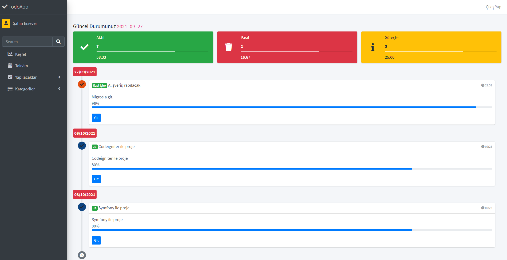

## TodoAPP - Projesi 
[Patika](https://patika.dev) PhpBasics eğitim seti için hazırladığım TodoApp uygulaması.

 
### Neler Yaptık?
- Roting ve İşlevles MVC Yapısı
- Çoklu Dil Altyapısı
- Veribanı Hazırlanması
- Login İşlemleri
- Profil ve Şifre Güncelleme İşlemleri
- Todo Kategorileri (Her oturum kendi kategorisini oluşturur.)
  - Ekleme
  - Silme
  - Güncelleme
  - Listeleme
- Yapılacaklar (Her oturum kendi listesi oluşturur.)
  - Ekleme
  - Güncelleme
  - Silme
  - Listeleme
  - Devam Eden - Biten
- FullCalendarAPI Entegrasyonu
- TimeLine Gösterimi
- İstatistikler

**AdminLTE** temasını indirmek için [buraya tıklayın](https://github.com/ColorlibHQ/AdminLTE/archive/refs/tags/v3.1.0.zip)

[PATİKA](https://app.patika.dev/) dev in Php dersleri çerçevesinde yaptığımız Todoapp çalışmasını içeren çalışmadır.

[Patika Profilim](https://app.patika.dev/sibgat)

[GitHub Profilim](https://github.com/Sibgatullahsanli)